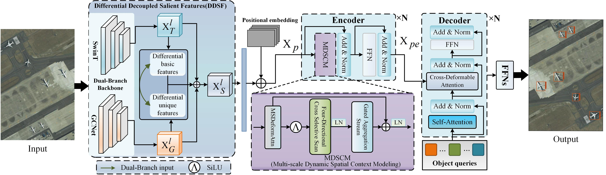

# DDM-DETR

The paper is currently under submission： "D2M-DETR: Differential Decoupling and Multi-scale Dynamic Modeling for Remote Sensing Small Object Detection". 

Authors:  Wenping Ma(Senior Member, IEEE) **Zhenyu Hu**, Hao Zhu(Member, IEEE), Xuqiang Lv, Weiwei Hou, and Mengru Ma, Member, IEEE



## News


## Model ZOO

We provide a set of baseline results and trained models available for download:

### Models with Swin Transformer backbones


DDM-DETR pretrained_weights: [model](https://github.com/yhj-1/DDM/releases/download/v1.0.0/DDM-DETR_swin_tiny_two_stage_36.pth)


## Installation

We test our models under ```python=3.10.8,pytorch=2.1.2,cuda=11.8```. Other versions might be available as well.

1. Clone this repo
```sh
git https://github.com/yhj-1/DDM.git
cd DDM
```

2. Install Pytorch and torchvision

Follow the instruction on https://pytorch.org/get-started/locally/.
```sh
# an example:
conda install -c pytorch pytorch torchvision
```

3. Install Mamba needed packages

```sh
cd selective_scan && pip install . && cd ..
```

4. Install other needed packages

```sh
pip install -r requirements.txt
pip install openmim
mim install mmcv-full
pip install mmdet
```

5. Compiling CUDA operators

```sh
cd models/ops
python setup.py build install
# unit test (should see all checking is True)
python test.py
cd ../..
```

## Data

Please download COCO-format dataset and organize them as following:
```
coco_path/
  ├── train2017/
  ├── val2017/
  └── annotations/
  	├── instances_train2017.json
  	└── instances_val2017.json
```
## Run
### To train a model using 8 cards

```Bash
GPUS_PER_NODE=8 ./tools/run_dist_launch.sh 8 <config path> \
    --coco_path <coco path>
```

To train a model backbone, you need to download the backbone from the [offical repo](https://github.com/microsoft/Swin-Transformer#main-results-on-imagenet-with-pretrained-models) frist and specify argument`--pretrained_backbone_path` like [our configs]([DDM/configs at main · yhj-1/DDM](https://github.com/yhj-1/DDM/tree/main/configs)).

### To eval a model using 8 cards

```Bash
GPUS_PER_NODE=8 ./tools/run_dist_launch.sh 8 <config path> \
    --coco_path <coco path> --eval --resume <checkpoint path>
```

### Distributed Run

You can refer to [Deformable-DETR](https://github.com/fundamentalvision/Deformable-DETR) to enable training on multiple nodes.

## Modified files compared to vanilla Deformable DETR

### To support Dual-Branch backbones
* models/backbone.py
* models/swin_transformer.py
* mmcv_custom

### To support eval in the training set
* datasets/coco.py
* datasets/\_\_init\_\_.py

### To support checkpoint
* main.py
* models/deformable_detr.py
* models/deformable_transformer.py

### To support Multi-scale Dynamic Spatial Context Modeling
* models/deformable_detr.py
* models/common_utils_mamba.py

### Addictional packages needed

* wandb: for logging
* mmdet: for swin backbones
* mmcv: for swin backbones
* timm: for swin backbones


